# 🧠 Machine Learning Lab Programs

This repository contains **Machine Learning lab programs (01–10)** implemented using Python and scikit-learn.  
Each program includes **source code, dataset, and output screenshots** for better understanding.

---

## 📌 Program List

1. Simple Linear Regression  
2. Student Performance Prediction  
3. Diabetes Prediction  
4. Handwritten Digit Recognition (KNN)  
5. Flower Classification (Decision Tree)  
6. Customer Churn Prediction  
7. Spam Email Classification (SVM)  
8. Customer Segmentation (K-Means)  
9. Market Basket Analysis (Apriori)  
10. Movie Recommendation System  

---

## 📊 Program 01: Simple Linear Regression – House Price Prediction

**Algorithm:** Linear Regression  
**Objective:** Predict house prices based on area  

### 🔹 Output
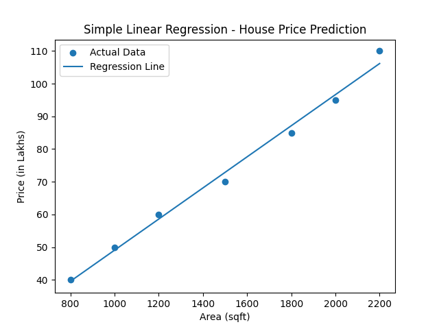
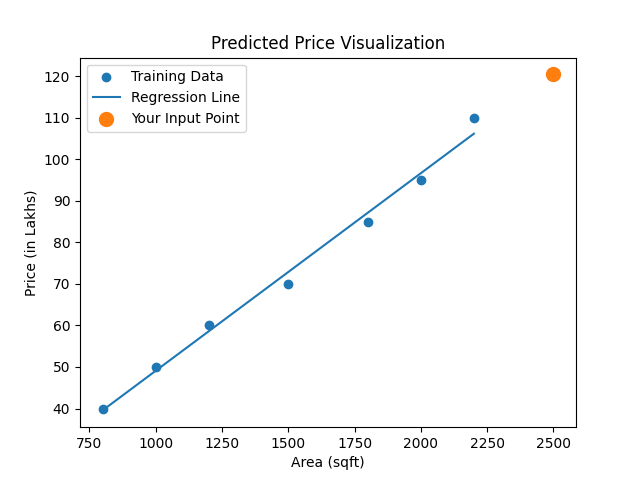

---

## 🎓 Program 02: Student Performance Prediction

**Algorithm:** Linear / Logistic Regression  
**Objective:** Predict student final score  

### 🔹 Output
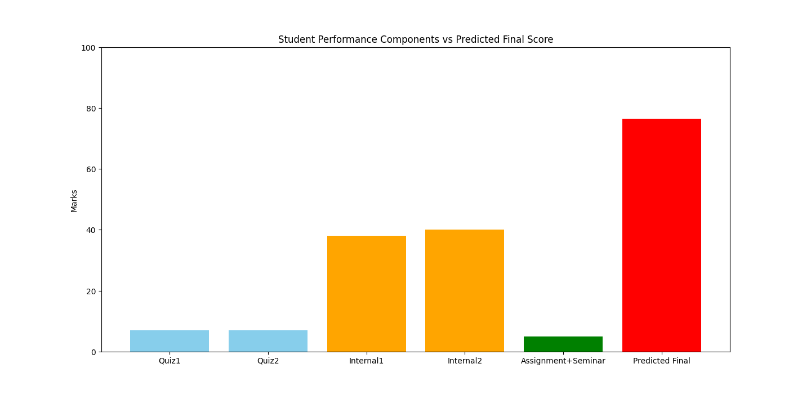

---

## 🩺 Program 03: Diabetes Prediction using Logistic Regression

**Algorithm:** Logistic Regression  
**Objective:** Predict whether a patient has diabetes based on medical parameters. 

### 🔹 Output
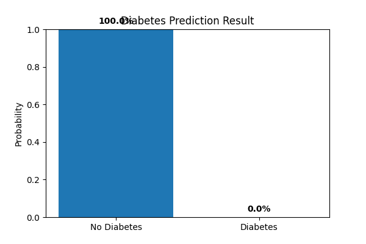

---

## ✍️ Program 04: Handwritten Digit Recognition (KNN)

**Algorithm:** K-Nearest Neighbors  
**Accuracy:** ~98%

### 🔹 Output
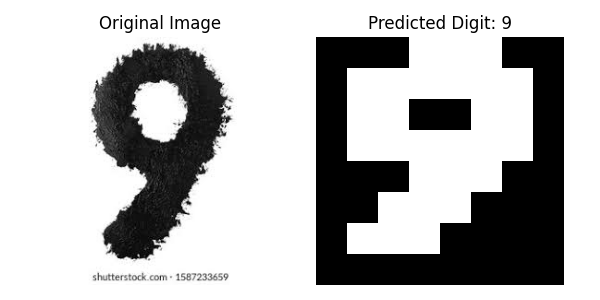

---

## 🌸 Program 05: Flower Classification using Decision Tree

**Algorithm:** Decision Tree  
**Dataset:** Iris Dataset  

### 🔹 Output
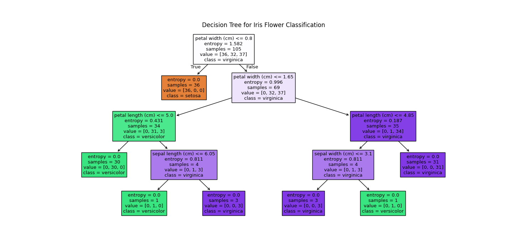

---

## 📉 Program 06: Customer Churn Prediction

**Algorithm:** Random Forest  
**Objective:** Predict customer churn  

### 🔹 Output
Model accuracy and predictions displayed in terminal output.

---

## 📧 Program 07: Spam Email Classification (SVM)

**Algorithm:** Support Vector Machine (SVM)  
**Metric:** Classify emails as Spam or Not Spam

### 🔹 Output
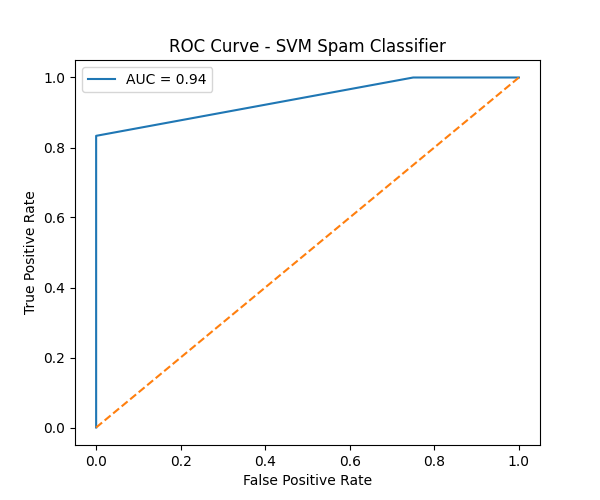

---

## 🧑‍🤝‍🧑 Program 08: Customer Segmentation using K-Means

**Algorithm:** K-Means Clustering  
**Metric:** Silhouette Score  

### 🔹 Output
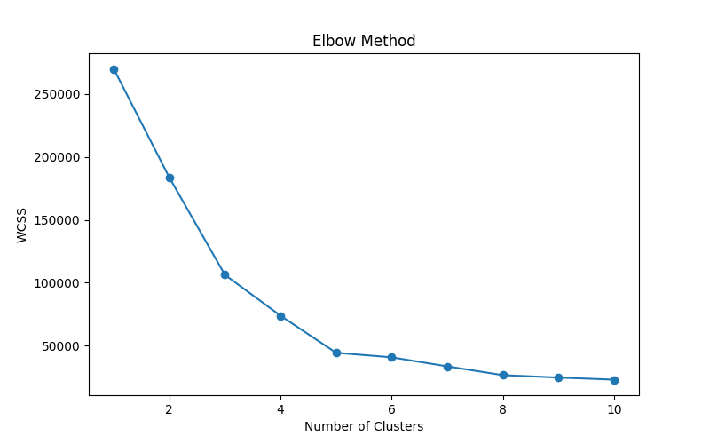
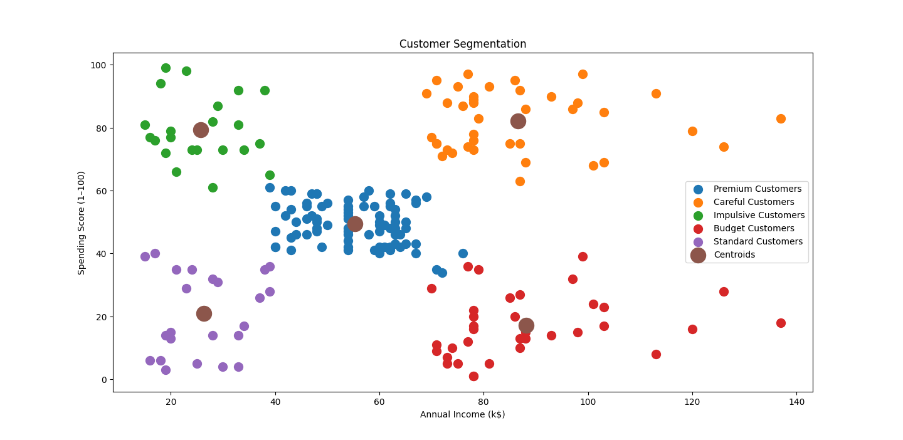

---

## 🛒 Program 09: Market Basket Analysis (Apriori)

**Algorithm:** Apriori  
**Objective:** Find frequent itemsets and association rules  

### 🔹 Output
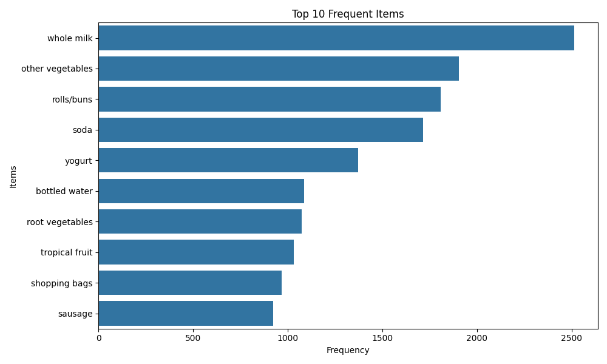
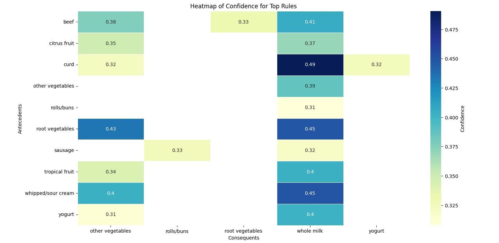

---

## 🎬 Program 10: Movie Recommendation System (Collaborative Filtering)

**Algorithm:** Collaborative Filtering  
**Objective:** Recommend movies based on user similarity and ratings  

### 🔹 Output

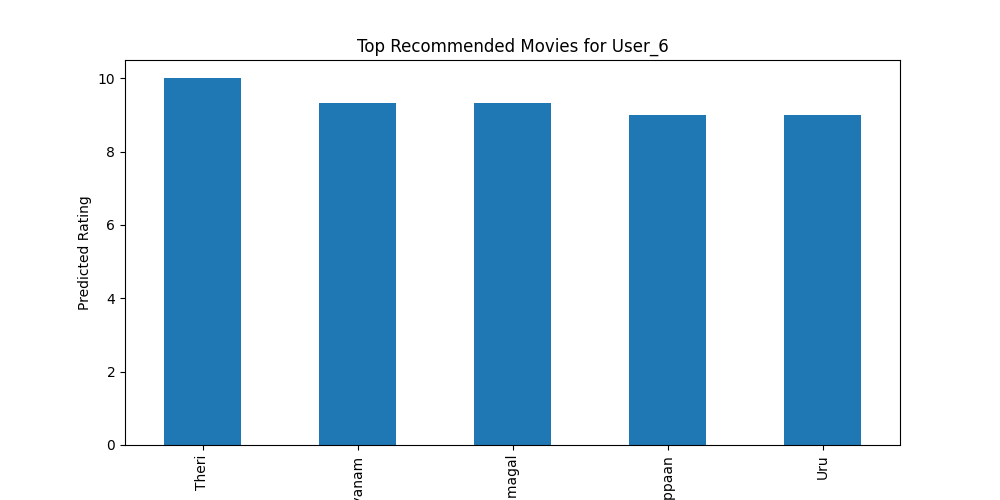
---

## 🛠️ Tools & Technologies Used

- Python
- NumPy
- Pandas
- Matplotlib
- Seaborn
- scikit-learn
- MLxtend

---

## ✨ Author

**Parkavi K**  
B.Sc Artificial Intelligence & Machine Learning  
GitHub: https://github.com/Paru-06